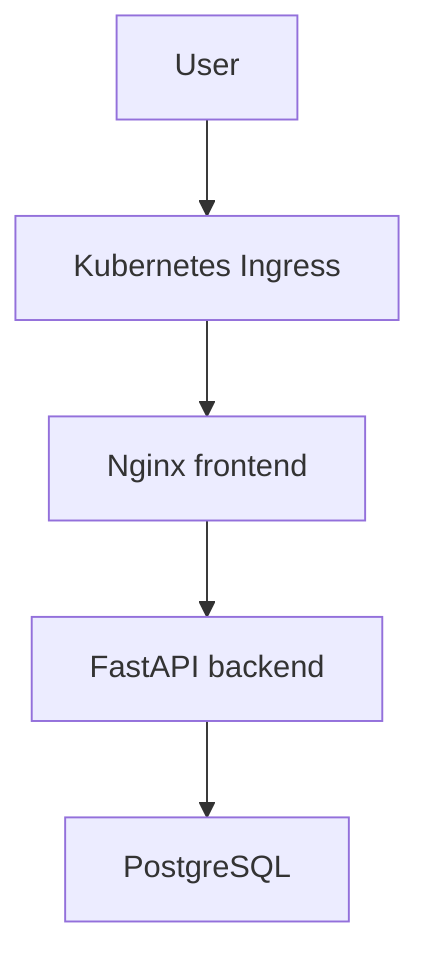

# MiniShop

[](https://github.com/TechWorld707/minishop-app/actions/workflows/build-scan-push.yml)

A containerized ecommerce application deployed to a self-managed Kubernetes cluster on AWS EC2, with automated image builds, Trivy vulnerability scanning, Amazon ECR publishing, and Argo CD GitOps delivery.

MiniShop demonstrates the complete path from application development to secure container publishing and Kubernetes deployment.

## Application architecture



## Components

| Component | Technology | Responsibility |
| --- | --- | --- |
| Frontend | HTML, CSS, JavaScript and Nginx | Serves the user interface and communicates with the API |
| Backend | FastAPI and SQLAlchemy | Provides product, order, health and readiness endpoints |
| Database | PostgreSQL | Stores application data |
| Container registry | Amazon ECR | Stores scanned frontend and backend images |
| CI/CD | GitHub Actions | Builds, scans and publishes container images |
| Deployment | Argo CD | Reconciles the desired Kubernetes state from Git |

## Repository model

MiniShop is separated into three repositories:

| Repository | Responsibility |
| --- | --- |
| [`minishop-app`](https://github.com/TechWorld707/minishop-app) | Stores application source code, container definitions and the image publishing workflow |
| [`minishop-gitops`](https://github.com/TechWorld707/minishop-gitops) | Defines the desired Kubernetes state continuously reconciled by Argo CD |
| [`minishop-infrastructure`](https://github.com/TechWorld707/minishop-infrastructure) | Documents the AWS EC2 kubeadm cluster infrastructure and rebuild process |

## Repository structure

```text
.
├── .github/
│   └── workflows/
│       └── build-scan-push.yml  # Builds, scans and publishes images
├── aws/                         # AWS authentication and supporting configuration
├── backend/                     # FastAPI backend application
├── frontend/                    # Nginx frontend application
├── .gitignore
├── docker-compose.yml           # Local development environment
└── README.md
```

## Run locally

### Prerequisites

Install:

- Docker
- Docker Compose
- Git

Clone the repository:

```bash
git clone https://github.com/TechWorld707/minishop-app.git
cd minishop-app
```

Build and start the application:

```bash
docker compose up --build
```

Open the application:

```text
http://localhost:8080
```

View the running containers:

```bash
docker compose ps
```

Follow the logs:

```bash
docker compose logs --follow
```

Stop the application:

```bash
docker compose down
```

To remove local volumes as well:

```bash
docker compose down --volumes
```

## API routes

| Method | Route | Purpose |
| --- | --- | --- |
| `GET` | `/api/products` | List available products |
| `GET` | `/api/orders` | List existing orders |
| `POST` | `/api/orders` | Create an order |
| `GET` | `/healthz` | Application liveness check |
| `GET` | `/readyz` | Application readiness check |

Example health check:

```bash
curl --fail http://localhost:8080/healthz
```

Example readiness check:

```bash
curl --fail http://localhost:8080/readyz
```

## Continuous integration

The `build-scan-push.yml` GitHub Actions workflow automates container delivery.

The workflow is designed to:

1. Check out the selected Git revision.
2. Authenticate to AWS.
3. Build the application container images.
4. Scan the images with Trivy.
5. Prevent unsafe images from progressing when configured severity thresholds are exceeded.
6. Tag approved images.
7. Push the images to Amazon ECR.
8. Make the published image references available for GitOps deployment.

The workflow badge at the top of this README displays the status of the latest workflow run.

## Container security

MiniShop uses Trivy to scan container images for known vulnerabilities.

The delivery process focuses on:

- Automated vulnerability scanning
- Controlled image publishing
- Traceable container image tags
- Amazon ECR as the container registry
- GitHub Actions-based automation
- Separation between image creation and Kubernetes deployment

A passing workflow badge confirms that the configured workflow completed successfully. It is not an AWS, GitHub or Terraform certification.

## GitOps deployment

The application repository builds and publishes container images but does not directly manage the running Kubernetes resources.

The deployment flow is:

1. Application code is changed.
2. GitHub Actions builds the frontend and backend images.
3. Trivy scans the images.
4. Approved images are pushed to Amazon ECR.
5. The GitOps repository references the required image versions.
6. Argo CD detects the desired-state change.
7. Argo CD synchronizes the application with the Kubernetes cluster.
8. Kubernetes performs the configured rollout.

This separation creates an auditable boundary between application delivery and cluster state.

## Kubernetes capabilities

The associated GitOps repository demonstrates:

- Deployments
- Services
- Ingress
- ConfigMaps
- Secrets integration
- Readiness and liveness probes
- Rolling updates
- Rollback through Git
- Role-based access control
- NetworkPolicies
- PersistentVolumes and PersistentVolumeClaims
- Horizontal Pod Autoscaling
- Argo CD reconciliation

See [`minishop-gitops`](https://github.com/TechWorld707/minishop-gitops) for the Kubernetes configuration.

## Deployment verification

Check the application workloads:

```bash
kubectl get pods
kubectl get deployments
kubectl get services
kubectl get ingress
```

Check autoscaling and network policies:

```bash
kubectl get hpa
kubectl get networkpolicy
```

Inspect application logs:

```bash
kubectl logs deployment/FRONTEND_DEPLOYMENT_NAME
kubectl logs deployment/BACKEND_DEPLOYMENT_NAME
```

Replace the deployment placeholders with the names defined in the GitOps repository.

## Security practices

This project demonstrates:

- Container vulnerability scanning with Trivy
- Image storage in Amazon ECR
- Automated delivery through GitHub Actions
- Kubernetes readiness and liveness probes
- Kubernetes RBAC
- NetworkPolicies
- GitOps-controlled deployment changes
- Separation of application and deployment repositories

Sensitive values must not be committed to this repository. Runtime secrets should be supplied through the Kubernetes deployment layer.

## Project scope

MiniShop is intentionally compact so the project can focus on container delivery and Kubernetes operations.

It demonstrates:

- Application containerization
- AWS container registry integration
- CI-based security scanning
- Self-managed Kubernetes operations on AWS EC2
- GitOps delivery with Argo CD
- Application health and readiness
- Kubernetes networking, storage and autoscaling

The project uses production-oriented practices but should be reviewed and adapted before handling real customer or payment data.

## Related repositories

- [MiniShop GitOps configuration](https://github.com/TechWorld707/minishop-gitops)
- [MiniShop infrastructure](https://github.com/TechWorld707/minishop-infrastructure)

## Author

**Henry — TechWorld707**

DevOps and Platform Engineer focused on AWS, Kubernetes, Terraform, Docker, Ansible, CI/CD and GitOps.

- [GitHub profile](https://github.com/TechWorld707)
- [Email](mailto:hento77@yahoo.com)
